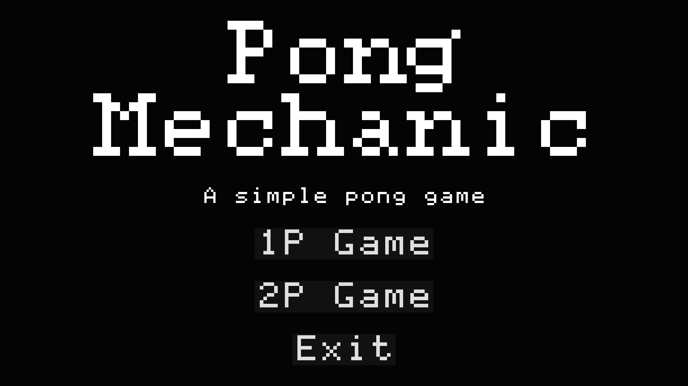
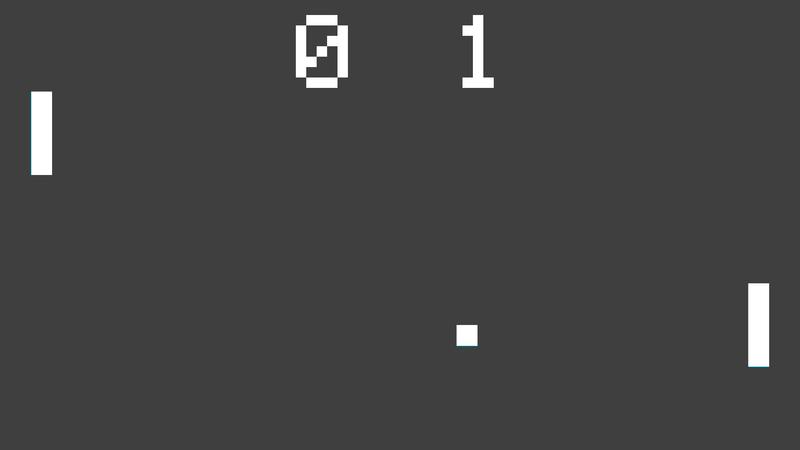
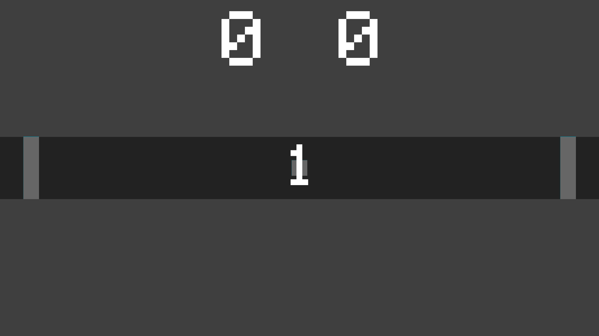
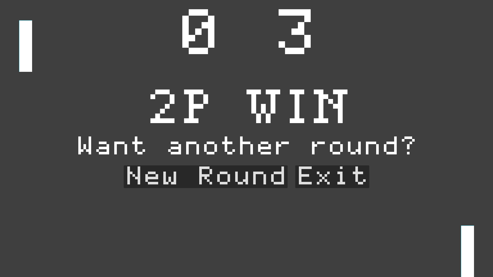

# PongMechanic - [Play it on itch.io](https://bastianleaf.itch.io/pong-mechanic)
Pong Mechanic is a classic arcade game developed using the Godot4 game engine. Inspired by the timeless gameplay of the original Pong, is a game designed to help players understand the mechanics of the original Pong game. By faithfully recreating the classic gameplay mechanics, players can experience the same simple yet challenging gameplay that made Pong a timeless classic.

## Description 
The game is perfect for players who want to learn how to play Pong or improve their skills. With easy-to-learn controls and intuitive gameplay, players can quickly understand the basic mechanics of the game and start practicing their paddle skills.

Players can expect the same classic mechanics that made Pong a timeless arcade classic. The two-player game is played by controlling paddles to hit a ball back and forth across the screen, with the first player to score 3 points declared the winner. The game features simple controls, easy-to-understand rules, and no-frills gameplay, just like the original.

## Game Modes
## 1P Mode
In this mode, players will compete against an AI opponent. The AI opponent is designed to provide a realistic and challenging gameplay experience, challenging players to use their paddle skills and strategic thinking to win.

## 2P Mode
Pong Mechanic offers a thrilling two-player mode, where players can compete against each other to see who is the ultimate Pong champion. In this mode, two players can play against each other on the same device, each controlling their own paddle.

## Controls

- Press `[esc]` to reset game.

### 1P Mode
- Use [W] and [S] to move.

### 2P Mode
- **Player 1**: Use `[W]` and `[S]` to move.
- **Player 2**: Use `[Up]` and `[Down]` to move.
## Image Gallery

